# POC: "Signal-to-Code" — Customer Signal → Shipped Feature Pipeline

> **Architecture reference:** The canonical architecture and three-signal-source design are in [POC_Signal_to_Code_Architecture.md](./POC_Signal_to_Code_Architecture.md). This PRD is aligned to that focus.

## The Elevator Pitch (Use This in Your Demo Intro)

"Enterprise teams lose customer signal at every handoff. A feature request starts as words on a call, a vote on a feature board, a pattern in support tickets — and by the time a developer sees it, it's been translated three times and the customer's actual pain is gone. What if your IDE could ingest signal from everywhere it lives — sales calls, feature request boards, support tickets — triangulate the patterns, and turn them into specs, code, and PRs with full customer attribution? That's what I built."

### The Three Signal Sources

The prototype ingests customer signal from three complementary channels:

| Source | What It Captures | Signal Type | Example MCP |
|--------|-----------------|-------------|-------------|
| **Gong** (calls) | What customers *say* they want — in conversations with your team | Conversational, unstructured, rich with emotion and context | `gong-mock` MCP |
| **Canny/ProductBoard** (feature boards) | What customers *formally request* — deliberate, structured, voted on | Structured, prioritized by community, explicit | `canny-mock` MCP |
| **Zendesk/Intercom** (support tickets) | What customers *struggle with* — implicit needs they'd never formally request | Implicit, pattern-based, reveals gaps nobody thought to ask about | `zendesk-mock` MCP |

**Why three sources matters:** No single channel tells the full story. The agent's job is to **triangulate across all three** so the strongest patterns surface (e.g. same feature in calls, feature board votes, and support tickets).

---

## Why This Wins the Interview

This prototype hits every single rubric item:

| Rubric Criteria | How This Delivers |
|-----------------|-------------------|
| **Improve developer velocity** | Eliminates the multi-week handoff chain (Gong → CRM → Jira → Sprint → Code → PR). Three signal sources triangulated into one spec, one session. |
| **Reduce cognitive load** | Developer never leaves Cursor. No context-switching between Gong, Canny, Zendesk, Jira, GitHub. The agent ingests all signals, writes the spec, builds the feature, and opens the PR. |
| **Increase code quality, safety, consistency** | Rules enforce architectural patterns, naming conventions, and test requirements. The agent writes tests based on the customer's exact words. Multi-source triangulation means specs are backed by stronger evidence than a single conversation. |
| **Well-scoped and opinionated** | One clear problem (context loss in the feedback-to-feature pipeline) with a clear solution (triangulate signals, generate attributed specs, build and ship). |
| **Grounded in real enterprise constraints** | Uses real MCP patterns (Gong, Canny, Zendesk, GitHub). Handles the customer vs. prospect distinction. Respects team workflows (PRs, code review, @mentions). |

And critically for Diggory specifically: **This is the workflow a Field Engineering team would kill for.** He ran SE teams at Vercel, Stripe, and Segment — he's lived the pain of the "we promised the customer X on a call six weeks ago and nobody built it" problem.

---

## Architecture Overview

```
┌─────────────────────────────────────────────────────────────────┐
│                        CURSOR IDE                                │
│                                                                   │
│  ┌──────────┐    ┌──────────────┐    ┌───────────────────────┐   │
│  │ .cursor/  │    │  Agent Mode  │    │  Background Agent     │   │
│  │ rules/    │    │  (Plan Mode) │    │  (for the PR)         │   │
│  │           │    │              │    │                       │   │
│  │ • signal  │    │  1. Ingest   │    │  • Branch creation    │   │
│  │   analysis│    │  2. Triangul.│    │  • Code generation    │   │
│  │ • spec    │    │  3. Spec     │    │  • Test generation    │   │
│  │   format  │    │  4. Build    │    │  • PR submission      │   │
│  │ • arch    │    │  5. Verify   │    │  • @mention routing   │   │
│  │   patterns│    │  6. PR       │    │                       │   │
│  └──────────┘    └──────┬───────┘    └───────────────────────┘   │
│                         │                                         │
│         ┌───────────────┼───────────────┐                        │
│         │        │      │      │        │                        │
│    ┌────▼───┐ ┌──▼───┐ ┌▼────┐ ┌▼──────┐ ┌▼─────────┐          │
│    │ Gong   │ │Canny │ │Zend.│ │GitHub │ │ Product  │          │
│    │ MCP    │ │ MCP  │ │ MCP │ │ MCP   │ │ Server   │          │
│    │(calls) │ │(feat)│ │(tix)│ │(PRs)  │ │ MCP(mock)│          │
│    └────────┘ └──────┘ └─────┘ └───────┘ └──────────┘          │
└─────────────────────────────────────────────────────────────────┘

Signal Sources:
  • Gong API ─────── What customers SAY they want (conversations)
  • Canny API ────── What customers FORMALLY REQUEST (feature votes)
  • Zendesk API ──── What customers STRUGGLE WITH (support tickets)

Action Targets:
  • GitHub API ───── Branches, commits, PRs, @mentions, reviewers
  • Product Server ─ Customer verification, tier/config checks (mock)
```

---

## The Six-Stage Pipeline

### Stage 1: INGEST — Pull Customer Signal from Three Sources

The agent pulls customer signal from all three sources (in parallel for the demo), creating a unified view of what customers are asking for.

**Source A: Gong (Calls)**  
**MCP Server:** `gong-mock` (mock for demo; real: `gongio-mcp` by JustinBeckwith)
- Tools: `search_calls`, `get_call_transcript`, `get_call_participants`
- Transcript: speaker-attributed text, timestamps, topics
- Participant metadata: names, emails, internal/external (customer vs prospect)

**Source B: Canny (Feature Requests)**  
**MCP Server:** `canny-mock` (mock for demo; Canny has a REST API that could be wrapped)
- Tools: `search_feature_requests`, `get_request_details`, `get_request_voters`
- Returns: title, description, vote count, status, voter companies, tags, comments

**Source C: Zendesk (Support Tickets)**  
**MCP Server:** `zendesk-mock` (mock for demo; Zendesk has an official API)
- Tools: `search_tickets`, `get_ticket_details`, `get_ticket_comments`
- Returns: subject, description, tags, requester company, ticket history, resolution status

**What happens:** Developer opens Cursor, prompts the agent:
> "Pull recent customer signal about analytics and export — check Gong calls from the last two weeks, related feature requests on Canny, and support tickets on Zendesk."

The agent calls all three MCPs. **For the demo,** Gong can be the richest mock; Canny and Zendesk mocks return pre-loaded data that correlates with the Gong transcripts so the agent can triangulate.

### Stage 2: TRIANGULATE — Cross-Source Signal Analysis

**Powered by:** Cursor Agent + Rules

The agent processes all three signal sources and produces a **triangulated analysis** — correlating signals across sources to surface the strongest patterns:

```markdown
## Customer Signal Analysis — Week of Feb 10, 2026

### Cross-Source Signal Map

| Feature | Gong Mentions | Canny Votes | Support Tickets | Strength |
|---------|:---:|:---:|:---:|---|
| CSV Bulk Export | 2 calls | 47 upvotes | 12 tickets | 🔴 CRITICAL |
| Azure AD SSO | 1 call | 23 upvotes | 3 tickets | 🟡 HIGH |
| Dashboard Customization | 1 call | 8 upvotes | 0 tickets | 🟢 MEDIUM |

### 🔴 CSV Bulk Export (CRITICAL — Triangulated Across All 3 Sources)

**Gong Signal:** Acme Corp call — Jane Smith (VP Eng): "My analysts are literally screenshotting charts and manually copying numbers. It's embarrassing." Beta Inc — David Kim asked about export during evaluation.

**Canny Signal:** "Bulk CSV export from analytics dashboard" — 47 upvotes; top voters include Acme Corp, Initech, Stark Industries. Status: Under Consideration (since Oct 2025).

**Zendesk Signal:** 12 tickets in last 90 days tagged "export" or "csv" — customers asking for workarounds. Most recent: Acme Corp — "Is there any way to export the monthly analytics as a CSV? We need this for board reporting."

**Triangulation:** Same customer (Acme Corp) is requesting via call, voting on Canny, AND filing support tickets. 47 community upvotes + 12 support tickets = strongest signal in the system.
```

**Rules that govern this stage:**
```
# .cursor/rules/signal-analysis.mdc
---
description: Rules for ingesting and triangulating customer signal across Gong, Canny, and Zendesk
globs: ["**/specs/**", "**/analysis/**"]
---

# Multi-Source Signal Analysis Rules

## Source Processing
- **Gong calls:** Identify each participant as CUSTOMER or PROSPECT. Extract exact quotes, pain points, competitive mentions, buying signals.
- **Canny requests:** Note vote count, top voter companies, request age, current status.
- **Zendesk tickets:** Identify implicit feature requests (workaround patterns), count tickets per theme, note requester companies.

## Triangulation
- Cross-reference by feature/theme across all three sources
- Flag features that appear in ALL THREE sources as CRITICAL
- Flag features in TWO sources as HIGH
- Single-source signals are MEDIUM
- Weight by: customer tier, deal size, vote count, ticket volume

## Signal Strength Rating
- 🔴 CRITICAL: Appears in 3 sources, or deal-blocking for >$100K prospect
- 🟡 HIGH: Appears in 2 sources, or mentioned by multiple customers
- 🟢 MEDIUM: Single source, single mention
- ⚪ LOW: Nice-to-have, no urgency signals

## Output Format
1. Cross-source signal map (table showing presence across all channels)
2. Per-feature deep dive (evidence from each source, exact quotes)
3. Triangulation summary (why the combined signal is stronger than any single source)
4. Customer quotes (exact words from transcripts, ticket text, Canny descriptions)
```

### Stage 3: SPEC — Triangulated Signal to Specification

**Powered by:** Cursor Agent + Spec Template Rule

The agent transforms the triangulated analysis into a formal product specification with **multi-source attribution**:

```markdown
# Feature Spec: CSV Bulk Export for Analytics Dashboard

## Origin (Multi-Source Attribution)
- **Gong calls:** Acme Corp (Feb 10), Beta Inc (Feb 12) — 2 calls
- **Canny:** "Bulk CSV export from analytics dashboard" — 47 upvotes, open since Oct 2025
- **Zendesk:** 12 tickets in last 90 days (tagged: export, csv, reporting)
- **Signal Strength:** 🔴 CRITICAL (all 3 sources, deal-blocking)
- **Primary Requestor:** Jane Smith (VP Eng, Acme — existing customer, Enterprise tier)
- **Competitive Context:** Datadog offers this; mentioned as comparison on Gong call
- **Revenue Impact:** Acme seat expansion (30 seats) + Beta Inc prospect conversion

## Problem Statement
Enterprise customers with large analytics datasets cannot export data 
in bulk for external reporting. They're currently screenshotting or 
manually copying, which doesn't scale. Support tickets reveal this is 
a recurring workaround pattern, not just a one-off request.

## Requirements
1. User can select date range and metrics for export
2. Export generates a CSV file with all selected data
3. Support for datasets up to 1M rows
4. Download via browser or send to email for large exports
5. Respect existing RBAC permissions (users only export what they can see)

## Acceptance Criteria
- [ ] CSV export button visible on analytics dashboard
- [ ] Date range picker works correctly
- [ ] Export respects user permissions
- [ ] Large exports (>10K rows) sent via email with download link
- [ ] Export includes column headers matching dashboard labels

## Technical Constraints
- Must integrate with existing `AnalyticsService`
- Must use the `ExportQueue` for async processing
- Must not impact dashboard query performance

## AI Attribution
- **Signal analysis:** AI-triangulated across Gong, Canny, Zendesk
- **Spec generation:** AI-generated from multi-source signal
- **Human review required:** Yes — spec approval before code generation
```

**Rules that govern this stage:**
```
# .cursor/rules/spec-template.mdc
---
description: Governs how specs are generated with multi-source attribution and traceability
globs: ["**/specs/**", "**/src/**"]
---

Every spec MUST include:
- Origin with MULTI-SOURCE attribution (which calls, feature requests, and tickets drove this)
- Signal strength rating (Critical/High/Medium/Low) based on cross-source triangulation
- Customer quotes (exact words from transcripts, ticket text, or Canny descriptions)
- Revenue impact (expansion opportunities, deal-blocking status, prospect conversion potential)
- Acceptance criteria as checkboxes
- Technical constraints from our architecture
- AI attribution section (which parts were AI-analyzed vs human-reviewed)

Every feature implementation MUST:
- Reference the spec file in the PR description
- Include tests that map 1:1 to acceptance criteria
- Not introduce new dependencies without justification
- Include signal source references in code comments for traceability
```

### Stage 4: BUILD — Spec to Feature Implementation

**Powered by:** Cursor Agent (Plan Mode) + Architecture Rules

The agent reads the spec and generates:
1. The feature code (following architectural patterns from rules)
2. Tests mapped to each acceptance criterion
3. Documentation updates if applicable

```
# .cursor/rules/architecture.mdc
---
description: Our standard architecture patterns and conventions
globs: ["**/src/**"]
---

Architecture patterns:
- Services go in src/services/
- API routes go in src/api/routes/
- React components go in src/components/
- Tests mirror source structure in src/__tests__/
- Use TypeScript strict mode
- All API endpoints must have input validation via Zod
- All services must be dependency-injected
- Naming: camelCase for functions, PascalCase for components, 
  kebab-case for files
- Domain language: Use "analytics" not "metrics", 
  "export" not "download", "workspace" not "organization"
```

**Key demo moment:** Show the agent in Plan Mode first — it produces a plan like:
```
Plan: Implement CSV Bulk Export

1. Create ExportService in src/services/export-service.ts
   - Method: generateCsvExport(dateRange, metrics, userId)
   - Integrates with existing AnalyticsService
   - Uses ExportQueue for async processing

2. Create API route in src/api/routes/export.ts
   - POST /api/exports — triggers export
   - GET /api/exports/:id — checks status / downloads

3. Create React component in src/components/ExportButton.tsx
   - Date range picker
   - Metric selector
   - Progress indicator

4. Create tests in src/__tests__/
   - export-service.test.ts (5 tests, one per acceptance criterion)
   - export-route.test.ts (API validation, permissions)
   - ExportButton.test.tsx (UI interactions)
```

Then approve the plan and let the agent build.

### Stage 5: VERIFY — Customer-Aware Validation

**Powered by:** Custom Product Server MCP (mock)

This is the clever part that differentiates your prototype. The agent checks:

**If the requester was a CUSTOMER:**
- Call the product server MCP to look up their account
- Verify the feature would work with their specific configuration
- Check their tier/permissions would allow access to this feature
- Add a note to the PR: "Verified: This feature is compatible with Acme Corp's Enterprise tier configuration"

**If the requester was a PROSPECT:**
- Don't call the product server (they don't have an account yet)
- Instead, flag in the PR: "Note: Globex Industries (prospect, in evaluation) requested this. @lisa-park (AE) — this feature may unblock their pilot."

**Mock MCP server for the demo:**
```javascript
// product-server-mcp/index.js — a simple mock
// Tools:
// - lookup_customer(email) → returns tier, config, permissions
// - verify_feature_compatibility(customer_id, feature_spec) → returns compatible: true/false, notes
// - get_account_contacts(customer_id) → returns AE, SE, CSM assigned
```

### Stage 6: SUBMIT — PR with Smart Routing

**MCP Server:** GitHub's official MCP server (`github/github-mcp-server`)
- Tools: create branches, commit files, create PRs, add reviewers, post comments

**What the agent does:**
1. Creates a feature branch: `feature/csv-bulk-export`
2. Commits all generated code + tests + spec
3. Opens a PR with a structured description:

```markdown
## CSV Bulk Export for Analytics Dashboard

### Signal Origin (Multi-Source)
| Source | Evidence |
|--------|----------|
| Gong | 2 calls: Acme Corp (Feb 10), Beta Inc (Feb 12) |
| Canny | 47 upvotes, open since Oct 2025 |
| Zendesk | 12 tickets in 90 days (workaround pattern) |
| **Signal Strength** | 🔴 CRITICAL — all 3 sources |

**Primary requestor:** Jane Smith, VP Eng, Acme Corp (Enterprise tier)

### Spec
See `specs/csv-bulk-export.md` for full specification traced to customer quotes.

### Changes
- `src/services/export-service.ts` — new ExportService
- `src/api/routes/export.ts` — POST/GET endpoints
- `src/components/ExportButton.tsx` — UI component
- `src/__tests__/` — 8 tests covering all acceptance criteria

### Customer Verification
✅ Verified compatible with Acme Corp's Enterprise configuration
📋 @lisa-park — Globex Industries (prospect) requested this; may unblock their pilot

### AI Attribution
- **Signal triangulation:** Cursor Agent (Gong + Canny + Zendesk MCPs)
- **Spec generation:** Cursor Agent (from multi-source analysis)
- **Code + tests:** Cursor Agent (Plan Mode, architecture rules)
- **Human review required:** Yes (pending)
- **Estimated time saved:** ~8 hours (signal synthesis + spec + scaffolding + routing)
- **Revenue impact:** Acme seat expansion (30 seats) + Beta Inc prospect conversion

### Reviewers
- @engineering-lead (code review)
- @product-manager (spec review)
```

4. @mentions the relevant AEs/SEs based on who was on the original calls
5. Tags the PR with labels: `customer-requested`, `revenue-impact`

---

## What to Build for the Demo (Practical Scoping)

You have limited time. Here's what to actually build vs. mock:

### BUILD (Working in Cursor):
1. **Mock Gong MCP server** — Node.js MCP that returns 2-3 pre-written realistic transcripts with participant metadata. This is the primary signal source and the most important piece to get right.
2. **Mock Canny MCP server** — Simple MCP with `search_feature_requests` and `get_request_details` that returns pre-loaded feature request data (vote counts, voter companies, descriptions). Lightweight — data should correlate with Gong transcripts.
3. **Mock Zendesk MCP server** — Simple MCP with `search_tickets` and `get_ticket_details` that returns pre-loaded support ticket data (subjects, tags, requester companies, patterns). Also lightweight.
4. **.cursor/rules/ directory** — 4-5 rule files (signal-analysis, spec-template, architecture, domain-language, pr-template). These are just markdown files — fast to create, high demo impact.
5. **Mock Product Server MCP** — Simple MCP with `lookup_customer` and `verify_compatibility` tools that return mock data.
6. **A starter codebase** — A minimal Next.js or Express app with an existing `AnalyticsService` so the agent has something to integrate with.

**Key insight on Canny + Zendesk mocks:** They can be very simple (50-80 lines each). Their purpose is to provide corroborating data that the agent triangulates with the Gong transcripts. The magic is in the cross-source correlation, not the individual fetches.

### MOCK / SIMULATE:
7. **GitHub MCP** — Use the real GitHub MCP (if you set up a demo repo) or show the PR description the agent would generate. Real is better if you have time.
8. **The actual code generation** — Let the agent run live. This is the "wow" moment. Seeing the agent generate code from triangulated customer signal is compelling.

### DON'T BUILD:
9. Real Gong/Canny/Zendesk integrations (use mocks)
10. Real product server integration (use mocks)
11. CI/CD pipeline
12. Production error handling

---

## Demo Script (30 Minutes)

### Opening (3 min)
"Enterprise teams lose customer signal at every handoff. A customer says 'I wish you had CSV export' on a Gong call. They vote for it on your feature board. They file three support tickets with workarounds. But those signals live in three different systems owned by three different teams — and nobody connects them. By the time a developer sees a Jira ticket, the customer's actual pain has been translated three times and the evidence is gone.

What if your IDE could ingest signal from everywhere it lives — sales calls, feature boards, support tickets — triangulate the patterns, and turn them into specs, code, and PRs with full customer attribution? That's what I built."

### Architecture Walkthrough (3 min)
Show the diagram. Explain the six stages. Emphasize: "This uses five MCP servers — Gong for call transcripts, Canny for feature requests, Zendesk for support tickets, a product server for customer verification, and GitHub for PR submission — all orchestrated by Cursor's agent with rules governing every step. The key innovation is the triangulation: the agent doesn't just read one source, it cross-references all three to surface the strongest signals."

### Live Demo (20 min)

**Step 1: Ingest** (4 min)
- Open Cursor with your demo project loaded
- Prompt: "Pull recent customer signal about analytics and export — check Gong calls from the last two weeks, related feature requests on Canny, and support tickets on Zendesk."
- The agent calls all three MCPs → returns data from each source
- Point out: "It pulled 2 Gong calls, a Canny request with 47 upvotes, and 12 Zendesk tickets. Three systems, three teams, one query."

**Step 2: Triangulation & Analysis** (4 min)
- The agent produces the cross-source signal map
- Point to the table: "CSV export appears in ALL THREE sources — calls, feature board, and support tickets. The agent rated it CRITICAL. And look: the same customer, Acme Corp, is signaling through every channel they have. No human does this synthesis today."
- Point out the Zendesk insight: "These 12 support tickets aren't feature requests. They're customers asking for workarounds — that's an *implicit* need pattern that would never show up in a prioritization meeting."

**Step 3: Spec Generation** (3 min)
- Prompt: "Based on the highest-priority signal — the CSV export — generate a feature spec following our template."
- Agent produces the spec with multi-source attribution, customer quotes from all channels
- Point out the rules: "Every spec has the same format. Every spec traces to evidence. The PM reviewing this has more signal than they'd ever assemble manually."

**Step 4: Plan Mode + Code Generation** (5 min)
- Switch to Plan Mode → Agent produces the plan
- Approve the plan, let the agent build
- As it generates: narrate what it's doing, point out how rules are being followed
- Show a test file: "This test maps to acceptance criterion #3 from the spec, which traces back to Jane Smith's words on the Gong call AND the 12 Zendesk tickets."

**Step 5: Customer Verification** (2 min)
- Prompt: "Verify this feature is compatible with Acme Corp's configuration."
- Agent calls product server MCP → returns compatibility check
- "For existing customers, we validate before we even open a PR."

**Step 6: PR Submission** (2 min)
- Prompt: "Open a PR for this feature. Include multi-source attribution, tag the relevant AEs, and note the customer impact."
- Show the PR description with signal origin table, AI attribution, @mentions
- "Lisa Park, the AE on the Globex call, gets notified. The PM sees the Canny upvotes. Engineering sees the spec. Everyone gets context in their language."

### Wrap-Up (1 min)
"What started as scattered signals — a Gong call, 47 Canny upvotes, 12 support tickets — is now a PR with tests, a spec traced to evidence from all three sources, customer verification, and the right people notified. But here's the metric that matters: this isn't 'AI wrote lines of code.' This is 'AI turned customer signal into a shipped feature that could close a deal and expand an account.' That's impact attribution, not activity attribution. And nobody is measuring that today."

### BONUS: The "Rough Edge" Beat (If Time Permits — 1 min)

**Why this matters:** The FDE role at Cursor includes shipping product internally when frontier features have rough edges. This beat shows you *living the role* during the interview itself.

After the wrap-up, briefly mention one genuine rough edge you encountered while building the prototype. For example:
- "While building this, I noticed that when the MCP server returns a large transcript, the agent sometimes truncates the analysis. I had to adjust the rule to explicitly tell it 'process the full transcript, do not summarize prematurely.' That's the kind of thing I'd file as a product feedback item — or better yet, contribute a fix for the rules documentation."
- Or: "The agent-requested rule type didn't trigger as reliably as I expected for the signal-analysis rule. I ended up using 'auto' with a glob pattern instead. That's a sharp edge I'd want to investigate and potentially fix."

**The line:** "This is exactly the FDE flywheel — while building a customer-facing workflow, I found a product improvement. That feedback loop is what makes the role work."

---

## Q&A Prep: Likely Questions & Answers

**Q: "What would break first at scale?"**
A: "Signal volume. If you're pulling 50 Gong calls, hundreds of Canny requests, and thousands of Zendesk tickets, the agent's context window fills up. The solve is a two-stage approach: first pass does lightweight categorization and cross-source correlation at the metadata level — just matching themes and customer names across sources. Second pass does deep analysis only on the signals that appear in multiple sources. The triangulation actually helps with scale: if something only appears in one source once, it's probably low priority. If it appears in all three, it's worth the deep dive."

**Q: "Why three sources instead of just Gong?"**
A: "Single-source signal gives you a biased picture. Gong only captures what customers say to Sales — and customers self-censor on calls. Canny captures what customers deliberately ask for — but misses implicit needs. Zendesk captures what customers actually struggle with — the workaround patterns nobody thinks to formally request. The 12 support tickets about CSV workarounds would never show up in a Gong call or a Canny vote. That's the richest signal and the most commonly ignored. Triangulation gives you a complete picture."

**Q: "How do you handle conflicting customer requests?"**
A: "Great question. The analysis stage already groups requests and counts mentions. If two customers ask for contradicting things, the spec stage should flag it and surface both perspectives. The agent shouldn't resolve the conflict — that's a product decision. But it should make the conflict visible."

**Q: "What about security? You're sending customer call data through an LLM."**
A: "This is exactly where Cursor's Privacy Mode matters. In Privacy Mode, nothing is stored or trained on. For extra-sensitive calls (legal, M&A), you'd want rules that redact PII before processing — and Hooks could enforce that automatically. You could also run the Gong MCP locally so transcripts never leave the network."

**Q: "How is this different from just using ChatGPT to summarize a transcript?"**
A: "ChatGPT can summarize one source. It can't orchestrate five MCP servers, triangulate signal across Gong, Canny, and Zendesk, generate a spec in your team's format, build the feature following your architecture rules, verify it against a customer's account, and open a PR with AI attribution — all in one session, governed by your team's rules, connected to your actual codebase. That's the difference between a chatbot and an IDE."

**Q: "What if the customer's request doesn't match our roadmap?"**
A: "The spec stage would still produce the spec, but the rules can include a check: 'If this feature conflicts with our stated architecture direction, flag it as NEEDS_PRODUCT_REVIEW and don't auto-generate code.' The agent becomes a triage tool, not an auto-builder. The point isn't to build everything customers ask for — it's to make sure nothing falls through the cracks."

**Q: "How would you evolve this over time?"**
A: Three phases:
1. **Phase 1 (what I built):** Mock MCPs, single developer, one-shot pipeline with three signal sources
2. **Phase 2:** Real Gong + Canny + Zendesk integrations, add Salesforce/HubSpot MCP for CRM context, add Linear/Jira MCP for automatic ticket creation. Background Agents process each source in parallel.
3. **Phase 3:** Continuous signal monitoring — Background Agents run nightly, ingesting new calls/requests/tickets, auto-triaging into 'build immediately' vs 'needs product review' vs 'log for future.' Weekly digest to Product with customer-weighted priority scores based on cross-source strength. Executive dashboard showing: what % of shipped features were customer-signal-originated, average time from first signal to shipped PR, revenue attributed to signal-driven features."

**Q: "How would you position this to a prospect?"**
A: "I'd position it to the VP of Engineering, Head of Product, and VP of Customer Success together — because this touches all three. The pitch: 'Your customer signal is scattered across Gong, your feature board, and your support desk — owned by three different teams. By the time a developer sees a Jira ticket, the customer's actual pain has been translated three times. What if your IDE could ingest signal from all three, triangulate the patterns, and build directly from the evidence?' This sells Cursor not as a code editor but as the connective tissue between your go-to-market org, your product org, and your engineering org."

**Q: "What rough edges did you find while building this?"**
A: [Use a genuine rough edge you encountered. Possible examples:]
- "The agent-requested rule type was less predictable than I expected — I found that `auto` rules with glob patterns gave me more reliable triggering. That's something I'd want to investigate further and potentially improve in the rules engine."
- "When the MCP server returns a large transcript, the agent sometimes truncates its analysis. I had to add explicit instructions in the rule: 'Process all pain points, do not summarize prematurely.' The UX for handling large MCP responses could be smoother."
- "MCP tool descriptions needed to be very precisely worded for the agent to pick the right tool. A small change in description wording changed which tool the agent chose. That's a sharp edge that new users will hit — better tooling for testing and debugging MCP tool selection would help."
*Then add:* "This is exactly the kind of thing I'd file as a detailed product issue or contribute a fix for. That feedback loop — finding rough edges in the field and turning them into product improvements — is the FDE flywheel."

**Q: "This is a new team. How would you help define what FDE engagements look like?"**
A: "I'd start empirically. Embed with 2-3 top customers in the first 6 weeks — small-scope engagements like building their first rule library or connecting an internal tool via MCP. The goal isn't to deliver a massive project; it's to observe patterns. Where do they get stuck? What do they ask for repeatedly? After those initial engagements, I'd write the first version of an engagement playbook — probably 3-4 engagement types: Codebase Onboarding Accelerators, Workflow Integration Packages, Migration Assistants, and maybe something we haven't thought of yet. Then iterate based on what actually delivers value."

**Q: "How do you think about balancing customer work and internal product contributions?"**
A: "They're the same flywheel. When I'm embedded with a customer and their Background Agent keeps failing on a specific pattern, that's not just a support issue — that's a product insight. I'd batch these up: every Friday, review rough edges from the week, file the ones that are genuine product issues, and either contribute a fix or write a detailed spec for the product team. The risk is only doing one side — pure customer work becomes consulting, pure product work loses the field signal."

---

## Files You'll Need to Create

```
demo-project/
├── .cursor/
│   ├── rules/
│   │   ├── signal-analysis.mdc      # How to ingest and triangulate signals
│   │   ├── spec-template.mdc        # Spec format with multi-source attribution
│   │   ├── architecture.mdc         # Code patterns and conventions
│   │   ├── domain-language.mdc      # Terminology enforcement
│   │   └── pr-template.mdc          # PR format with AI attribution
│   └── mcp.json                     # MCP server configuration (5 servers)
├── mcp-servers/
│   ├── gong-mock/
│   │   ├── index.js                 # Mock Gong MCP server (primary, richest data)
│   │   └── package.json
│   ├── canny-mock/
│   │   ├── index.js                 # Mock Canny MCP server (feature requests, votes)
│   │   └── package.json
│   ├── zendesk-mock/
│   │   ├── index.js                 # Mock Zendesk MCP server (support tickets, patterns)
│   │   └── package.json
│   └── product-server-mock/
│       ├── index.js                 # Mock product server MCP (customer verification)
│       └── package.json
├── src/
│   ├── services/
│   │   └── analytics-service.ts     # Pre-existing service to integrate with
│   ├── api/
│   │   └── routes/                  # Existing routes
│   ├── components/                  # Existing components
│   └── __tests__/                   # Existing test structure
├── specs/                           # Where generated specs land
└── README.md
```

---

## The One Sentence to Close On

If they ask "why should we hire you?" at any point, come back to this:

**"I built a prototype that ingests customer signal from three sources — calls, feature boards, and support tickets — triangulates the patterns, and turns them into specs, code, and PRs with full impact attribution. Not 'AI wrote lines of code.' 'AI turned this customer's pain into this shipped feature that closed this deal.' That's the metric enterprises actually want. While building it, I found product improvements I'd ship back to the team. That's both halves of the FDE role. I want to do this for real, with your biggest customers, and help define what this team becomes."**


# How to Actually Build This in Cursor
## A Zero-to-Demo Guide for Someone Who's Never Built a Cursor Customization

> **REMEMBER:** You're the first official FDE interview. The role is dual-mandate — customer embedding + internal product work. While building, **actively note rough edges** you encounter in Cursor's rules, MCP, or agent behavior. These become a demo moment that proves you're already living the role.

---

## First: You Are NOT Building an Extension

This is the most important mental model shift. In VS Code world, you'd build an extension with a `package.json`, activation events, commands, etc. **Cursor doesn't work that way.**

In Cursor, you customize behavior through three primitives that are just **files in your project directory**:

| Primitive | What it is | Where it lives | Format |
|-----------|-----------|----------------|--------|
| **Rules** | Instructions baked into every AI prompt | `.cursor/rules/*.mdc` | Markdown with YAML frontmatter |
| **MCP Servers** | External tools the AI agent can call | `.cursor/mcp.json` (config) + a Node.js/Python script (server) | JSON config + any language |
| **Slash Commands** | Reusable prompt templates | `.cursor/commands/*.md` | Markdown |

That's it. No extension API. No marketplace. No build step for Cursor itself. You write some markdown files, write a small Node.js server, point Cursor at it, and the agent can use your tools.

---

## The Four Things You're Building

```
┌─────────────────────────────────────────┐
│            YOUR PROJECT FOLDER           │
│                                          │
│  1. .cursor/rules/*.mdc                  │  ← Just markdown files
│     (Tell the AI HOW to behave)          │
│                                          │
│  2. .cursor/mcp.json                     │  ← JSON config pointing to...
│                                          │
│  3. mcp-servers/                          │  ← Node.js scripts that
│     gong-mock, canny-mock, zendesk-mock,  │     return fake data (signal
│     product-mock/index.js                 │     sources + verification)
│                                          │
│  4. src/  (a starter codebase)           │  ← Something for the agent
│     package.json, tsconfig, etc.         │     to actually modify
└─────────────────────────────────────────┘
```

Let's build each one.

---

## PIECE 1: Rules (`.cursor/rules/`)

Rules are markdown files with YAML frontmatter. When the agent runs, Cursor injects the relevant rules into the prompt based on the `globs` pattern or the `alwaysApply` flag.

### How to create them

Just create the directory and add `.mdc` files:

```bash
mkdir -p .cursor/rules
```

### Rule File #1: `signal-analysis.mdc`

```markdown
---
description: How to ingest and triangulate customer signal across Gong, Canny, and Zendesk
globs: ["**/specs/**", "**/analysis/**"]
alwaysApply: false
---

# Multi-Source Signal Analysis Rules

## Source Processing
- **Gong calls:** Identify each participant as CUSTOMER or PROSPECT. Extract exact quotes, pain points, competitive mentions, buying signals.
- **Canny requests:** Note vote count, top voter companies, request age, current status.
- **Zendesk tickets:** Identify implicit feature requests (workaround patterns), count tickets per theme, note requester companies.

## Triangulation
- Cross-reference by feature/theme across all three sources
- Flag features that appear in ALL THREE sources as CRITICAL
- Flag features in TWO sources as HIGH
- Single-source signals are MEDIUM
- Weight by: customer tier, deal size, vote count, ticket volume

## Signal Strength Rating
- 🔴 CRITICAL: Appears in 3 sources, or deal-blocking for >$100K prospect
- 🟡 HIGH: Appears in 2 sources, or mentioned by multiple customers
- 🟢 MEDIUM: Single source, single mention
- ⚪ LOW: Nice-to-have, no urgency signals

## Output Format
1. Cross-source signal map (table showing presence across all channels)
2. Per-feature deep dive (evidence from each source, exact quotes)
3. Triangulation summary (why the combined signal is stronger than any single source)
4. Customer quotes (exact words from transcripts, ticket text, Canny descriptions)
```

### Rule File #2: `spec-template.mdc`

```markdown
---
description: Template and rules for generating feature specifications with multi-source attribution
globs: ["**/specs/**"]
alwaysApply: false
---

# Feature Specification Rules

Every spec MUST follow this template:

## Required Sections
1. **Origin (Multi-Source Attribution)** - Which Gong calls, Canny requests, and Zendesk tickets drove this (with signal strength: Critical/High/Medium/Low)
2. **Problem Statement** - The customer's pain in plain English
3. **Customer Quotes** - Exact words from transcripts, ticket text, or Canny descriptions
4. **Requirements** - Numbered list of what must be built
5. **Acceptance Criteria** - Checkboxes that map 1:1 to tests
6. **Technical Constraints** - Integration points, performance requirements
7. **Stakeholder Routing** - Which AEs/SEs to notify on the PR
8. **AI Attribution** - Which parts were AI-analyzed vs human-reviewed

## Rules
- Never generate a spec without tracing it to specific customer signal (calls, feature requests, and/or tickets)
- Always include multi-source attribution and signal strength from triangulation
- Always include the customer/prospect distinction
- If requirements conflict with our architecture, flag as NEEDS_PRODUCT_REVIEW
- Acceptance criteria must be testable — no vague language like "should work well"
```

### Rule File #3: `architecture.mdc`

```markdown
---
description: Our codebase architecture patterns, naming conventions, and technical standards
globs: ["**/src/**"]
alwaysApply: true
---

# Architecture Standards

## File Structure
- Services: `src/services/`
- API routes: `src/api/routes/`
- React components: `src/components/`
- Tests: `src/__tests__/` (mirrors source structure)
- Specs: `specs/`

## Conventions
- TypeScript strict mode
- camelCase for functions/variables
- PascalCase for components/classes/types
- kebab-case for filenames
- All API endpoints validated with Zod schemas
- All services use dependency injection

## Domain Language (ENFORCED)
Use these terms consistently:
- "workspace" (NOT "organization" or "tenant")
- "analytics" (NOT "metrics" or "stats")
- "export" (NOT "download")
- "member" (NOT "user" or "account")

## Testing Requirements
- Every acceptance criterion in a spec = one test
- Tests go in `src/__tests__/` mirroring the source path
- Use vitest for unit tests
- API routes need both validation tests and happy-path tests

## PR Standards
- PR description must reference the spec file
- Include AI attribution metadata (see pr-template rule)
- Tag relevant AEs/SEs from the originating customer calls
```

### Rule File #4: `pr-template.mdc`

```markdown
---
description: Template for pull request descriptions with AI attribution and customer context
globs: []
alwaysApply: false
---

# PR Description Template

When creating a pull request, use this format:

## [Feature Name]

### Signal Origin (Multi-Source)
- Table or list: Gong calls, Canny requests, Zendesk tickets that drove this
- Signal strength (Critical/High/Medium/Low) from triangulation
- Customer vs prospect distinction; deal impact (blocking, accelerating, expanding)

### Spec Reference
Link to the spec file in `specs/`

### Changes
List of files created/modified with brief descriptions

### Customer Verification
- For customers: verification result from product server
- For prospects: flag for AE with context

### AI Attribution
- Signal triangulation: Cursor Agent (Gong + Canny + Zendesk MCPs)
- Spec generated by: Cursor Agent (from multi-source signal)
- Code generated by: Cursor Agent
- Tests generated by: Cursor Agent
- Human review required: Yes
- Estimated time saved: [X hours]

### Stakeholder Notifications
- @[ae-username] — [context about why they should know]

### Auto-Standup Entry
```
Completed: [Feature name] (PR #[number])
Origin: [Customer/prospect name] call on [date]
Files: [count] created, [count] tests written
AI-assisted: spec, code scaffolding, tests
Human: architecture review, acceptance validation
```
```

---

## PIECE 2: MCP Servers

### What is an MCP Server, Really?

An MCP server is just a program that:
1. Reads JSON from stdin
2. Responds with JSON on stdout
3. Declares what "tools" it has (functions the AI can call)
4. Executes those tools when asked

Cursor starts the process for you. You just tell it what command to run.

### The Configuration: `.cursor/mcp.json`

This file goes in your project root (for project-specific servers) or `~/.cursor/mcp.json` (for global servers):

```json
{
  "mcpServers": {
    "gong-mock": {
      "command": "node",
      "args": ["./mcp-servers/gong-mock/index.js"]
    },
    "canny-mock": {
      "command": "node",
      "args": ["./mcp-servers/canny-mock/index.js"]
    },
    "zendesk-mock": {
      "command": "node",
      "args": ["./mcp-servers/zendesk-mock/index.js"]
    },
    "product-server-mock": {
      "command": "node",
      "args": ["./mcp-servers/product-mock/index.js"]
    }
  }
}
```

That's it for the config. Cursor sees this, starts all four processes, and the agent can call their tools (five servers when GitHub MCP is added for PR submission).

### Building the Mock Gong MCP Server

```bash
mkdir -p mcp-servers/gong-mock
cd mcp-servers/gong-mock
npm init -y
npm install @modelcontextprotocol/sdk
```

#### `mcp-servers/gong-mock/index.js`

```javascript
#!/usr/bin/env node
import { McpServer } from "@modelcontextprotocol/sdk/server/mcp.js";
import { StdioServerTransport } from "@modelcontextprotocol/sdk/server/stdio.js";
import { z } from "zod";

const server = new McpServer({
  name: "gong-mock",
  version: "1.0.0",
});

// ============================================
// MOCK DATA — This is what makes your demo work
// ============================================

const MOCK_CALLS = [
  {
    id: "call-001",
    title: "Acme Corp - Q1 Analytics Review",
    date: "2026-02-10T14:00:00Z",
    duration: 2700,
    participants: [
      {
        name: "Jane Smith",
        email: "jane@acmecorp.com",
        title: "VP of Engineering",
        company: "Acme Corp",
        isExternal: true,
      },
      {
        name: "Mike Chen",
        email: "mike@ourcompany.com",
        title: "Account Executive",
        company: "Our Company",
        isExternal: false,
      },
      {
        name: "Sarah Lee",
        email: "sarah@ourcompany.com",
        title: "Solutions Engineer",
        company: "Our Company",
        isExternal: false,
      },
    ],
    topics: ["analytics", "export", "reporting", "competitor-mention"],
  },
  {
    id: "call-002",
    title: "Globex Industries - Technical Evaluation",
    date: "2026-02-12T10:00:00Z",
    duration: 1800,
    participants: [
      {
        name: "Tom Wilson",
        email: "tom@globex.com",
        title: "CTO",
        company: "Globex Industries",
        isExternal: true,
      },
      {
        name: "Lisa Park",
        email: "lisa@ourcompany.com",
        title: "Account Executive",
        company: "Our Company",
        isExternal: false,
      },
    ],
    topics: ["sso", "security", "compliance", "evaluation"],
  },
];

const MOCK_TRANSCRIPTS = {
  "call-001": [
    {
      speaker: "Mike Chen",
      timestamp: "00:02:15",
      text: "Jane, thanks for making time. How's the team finding the analytics dashboard?",
    },
    {
      speaker: "Jane Smith",
      timestamp: "00:02:45",
      text: "Honestly, the dashboard itself is great. My team loves the real-time view. But we have a real problem with reporting.",
    },
    {
      speaker: "Jane Smith",
      timestamp: "00:03:10",
      text: "Every quarter, I need to pull data for our board deck. Right now, my analysts are literally screenshotting charts and manually copying numbers into spreadsheets. It's embarrassing.",
    },
    {
      speaker: "Sarah Lee",
      timestamp: "00:03:35",
      text: "That's painful. What format does your board reporting need?",
    },
    {
      speaker: "Jane Smith",
      timestamp: "00:03:50",
      text: "CSV would be perfect. We just need to be able to select a date range, pick which metrics we want, and export. Datadog lets us do this and we're getting pressure to switch.",
    },
    {
      speaker: "Mike Chen",
      timestamp: "00:04:20",
      text: "I hear you. How urgent is this for your team?",
    },
    {
      speaker: "Jane Smith",
      timestamp: "00:04:35",
      text: "Very. Our Q1 board meeting is in six weeks. If we can't export by then, I'll have to escalate to my CTO and we might need to evaluate alternatives. But honestly I'd rather just have you fix it. We love everything else about the product.",
    },
    {
      speaker: "Jane Smith",
      timestamp: "00:05:00",
      text: "Also, if you ship this, I've been talking to our VP of Sales about getting seats for his team too. That would be another 30 seats.",
    },
  ],
  "call-002": [
    {
      speaker: "Lisa Park",
      timestamp: "00:01:00",
      text: "Tom, excited to walk through the platform today. What are the key things you need to see?",
    },
    {
      speaker: "Tom Wilson",
      timestamp: "00:01:20",
      text: "Two things are make-or-break for us. First, SSO. We're an Azure AD shop and everything has to go through our identity provider. No SSO, no deal.",
    },
    {
      speaker: "Tom Wilson",
      timestamp: "00:01:50",
      text: "Second, I need to understand your security posture. We're in financial services so SOC 2 is table stakes. Are you compliant?",
    },
    {
      speaker: "Lisa Park",
      timestamp: "00:02:15",
      text: "Great news on SOC 2 — we're Type II certified. On SSO, we support SAML and OIDC. Azure AD works natively.",
    },
    {
      speaker: "Tom Wilson",
      timestamp: "00:02:45",
      text: "Oh, that's actually ahead of where I thought you'd be. My team of 50 engineers has been struggling with our current tool. If SSO and the security story check out, we have budget approved for this quarter.",
    },
  ],
};

// ============================================
// TOOL DEFINITIONS — These are what the agent calls
// ============================================

server.tool(
  "search_calls",
  "Search Gong calls by date range or topic keywords. Returns call metadata including participants.",
  {
    fromDate: z.string().optional().describe("Start date ISO format"),
    toDate: z.string().optional().describe("End date ISO format"),
    keywords: z
      .array(z.string())
      .optional()
      .describe("Topic keywords to filter by"),
  },
  async ({ fromDate, toDate, keywords }) => {
    let results = [...MOCK_CALLS];

    if (keywords && keywords.length > 0) {
      results = results.filter((call) =>
        call.topics.some((topic) =>
          keywords.some((kw) => topic.toLowerCase().includes(kw.toLowerCase()))
        )
      );
    }

    return {
      content: [
        {
          type: "text",
          text: JSON.stringify(results, null, 2),
        },
      ],
    };
  }
);

server.tool(
  "get_transcript",
  "Get the full transcript for a specific Gong call. Returns speaker-attributed, timestamped dialogue.",
  {
    callId: z.string().describe("The Gong call ID"),
  },
  async ({ callId }) => {
    const transcript = MOCK_TRANSCRIPTS[callId];
    if (!transcript) {
      return {
        content: [
          {
            type: "text",
            text: `No transcript found for call ${callId}`,
          },
        ],
      };
    }

    return {
      content: [
        {
          type: "text",
          text: JSON.stringify(transcript, null, 2),
        },
      ],
    };
  }
);

server.tool(
  "get_call_participants",
  "Get participant details for a call, including whether they are internal or external (customer/prospect).",
  {
    callId: z.string().describe("The Gong call ID"),
  },
  async ({ callId }) => {
    const call = MOCK_CALLS.find((c) => c.id === callId);
    if (!call) {
      return {
        content: [{ type: "text", text: `Call ${callId} not found` }],
      };
    }

    return {
      content: [
        {
          type: "text",
          text: JSON.stringify(call.participants, null, 2),
        },
      ],
    };
  }
);

// ============================================
// START SERVER
// ============================================

const transport = new StdioServerTransport();
await server.connect(transport);
```

### Building the Mock Product Server MCP

```bash
mkdir -p mcp-servers/product-mock
cd mcp-servers/product-mock
npm init -y
npm install @modelcontextprotocol/sdk
```

#### `mcp-servers/product-mock/index.js`

```javascript
#!/usr/bin/env node
import { McpServer } from "@modelcontextprotocol/sdk/server/mcp.js";
import { StdioServerTransport } from "@modelcontextprotocol/sdk/server/stdio.js";
import { z } from "zod";

const server = new McpServer({
  name: "product-server-mock",
  version: "1.0.0",
});

const MOCK_CUSTOMERS = {
  "jane@acmecorp.com": {
    customerId: "cust-acme-001",
    company: "Acme Corp",
    tier: "Enterprise",
    seats: 150,
    features: ["analytics-dashboard", "api-access", "sso-saml", "custom-reports"],
    ae: { name: "Mike Chen", email: "mike@ourcompany.com", github: "mike-chen" },
    se: { name: "Sarah Lee", email: "sarah@ourcompany.com", github: "sarah-lee" },
    status: "active",
    renewalDate: "2026-09-01",
  },
};

server.tool(
  "lookup_customer",
  "Look up a customer account by email address. Returns tier, features, assigned AE/SE, and account status.",
  {
    email: z.string().describe("Email address of the contact"),
  },
  async ({ email }) => {
    const customer = MOCK_CUSTOMERS[email];
    if (!customer) {
      return {
        content: [
          {
            type: "text",
            text: JSON.stringify({
              found: false,
              status: "prospect",
              message: `No customer account found for ${email}. This person is likely a prospect.`,
            }, null, 2),
          },
        ],
      };
    }

    return {
      content: [
        {
          type: "text",
          text: JSON.stringify({ found: true, ...customer }, null, 2),
        },
      ],
    };
  }
);

server.tool(
  "verify_feature_compatibility",
  "Check if a proposed feature is compatible with a customer's current tier and configuration.",
  {
    customerId: z.string().describe("Customer ID"),
    featureName: z.string().describe("Name of the proposed feature"),
    featureDescription: z.string().describe("Brief description of what the feature does"),
  },
  async ({ customerId, featureName, featureDescription }) => {
    // Mock: always return compatible for Enterprise tier
    return {
      content: [
        {
          type: "text",
          text: JSON.stringify({
            compatible: true,
            customerId,
            feature: featureName,
            tier: "Enterprise",
            notes: "Feature is compatible with Enterprise tier. No additional configuration required. Customer has API access enabled which supports the export endpoint.",
          }, null, 2),
        },
      ],
    };
  }
);

const transport = new StdioServerTransport();
await server.connect(transport);
```

**Important for both servers:** Make sure `package.json` has `"type": "module"` so ES module imports work:

```json
{
  "name": "gong-mock",
  "version": "1.0.0",
  "type": "module",
  "dependencies": {
    "@modelcontextprotocol/sdk": "^1.0.0"
  }
}
```

---

## PIECE 3: The Starter Codebase

Create a minimal app so the agent has something to build on:

```bash
# In your project root
npm init -y
npm install typescript zod express
npm install -D @types/node @types/express vitest
```

Create a few existing files so the agent integrates with them rather than building from scratch:

#### `src/services/analytics-service.ts`
```typescript
// Existing analytics service — the agent should integrate with this
export interface DateRange {
  start: Date;
  end: Date;
}

export interface AnalyticsQuery {
  dateRange: DateRange;
  metrics: string[];
  workspaceId: string;
}

export interface AnalyticsResult {
  data: Record<string, number[]>;
  labels: string[];
  totalRows: number;
}

export class AnalyticsService {
  async query(params: AnalyticsQuery): Promise<AnalyticsResult> {
    // In production this hits the database
    // For demo purposes, returns mock data
    return {
      data: Object.fromEntries(
        params.metrics.map((m) => [m, Array(30).fill(0).map(() => Math.random() * 100)])
      ),
      labels: Array(30)
        .fill(0)
        .map((_, i) => `Day ${i + 1}`),
      totalRows: 30,
    };
  }
}
```

#### `src/api/routes/analytics.ts`
```typescript
import { Router } from "express";
import { z } from "zod";
import { AnalyticsService } from "../../services/analytics-service.js";

const router = Router();
const analyticsService = new AnalyticsService();

const querySchema = z.object({
  startDate: z.string(),
  endDate: z.string(),
  metrics: z.array(z.string()),
  workspaceId: z.string(),
});

router.post("/query", async (req, res) => {
  const parsed = querySchema.safeParse(req.body);
  if (!parsed.success) {
    return res.status(400).json({ error: parsed.error });
  }
  const result = await analyticsService.query({
    dateRange: {
      start: new Date(parsed.data.startDate),
      end: new Date(parsed.data.endDate),
    },
    metrics: parsed.data.metrics,
    workspaceId: parsed.data.workspaceId,
  });
  res.json(result);
});

export default router;
```

---

## PIECE 4: Verifying It All Works

### Step 1: Open the project in Cursor

```bash
# From your project root
cursor .
```

### Step 2: Check MCP servers connected

Go to **Cursor Settings** (Cmd+Shift+J) → **MCP** → you should see your two servers listed. Click refresh if needed. Green dot = connected.

### Step 3: Test the Gong MCP

Open the Agent chat (Cmd+L) and type:

> "Using the Gong tools, search for any recent customer calls about analytics or export."

The agent should call `search_calls` on your mock server and return the Acme Corp and Globex calls.

### Step 4: Run the full pipeline

> "Pull recent customer signal about analytics and export — Gong calls, Canny feature requests, and Zendesk tickets. Triangulate and analyze using our signal-analysis rules. Then generate a feature spec for the highest-priority signal."

This exercises: MCPs (Gong, Canny, Zendesk) → Rules (signal-analysis) → Rules (spec-template)

### Step 5: Build the feature

> "Switch to Plan Mode. Implement the spec you just generated, following our architecture standards. Create tests for every acceptance criterion."

This exercises: Rules (architecture) → Plan Mode → Code Generation

### Step 6: Verify and mock-PR

> "Look up Jane Smith's account using the product server. Verify this feature is compatible with Acme Corp's configuration."

Then:

> "Generate a PR description following our PR template. Include the AI attribution and tag the relevant AEs from the call."

---

## Complete File Tree

```
signal-to-code-demo/
├── .cursor/
│   ├── mcp.json                          # Points to your MCP servers (5: Gong, Canny, Zendesk, Product, GitHub)
│   └── rules/
│       ├── signal-analysis.mdc           # How to ingest and triangulate signals
│       ├── spec-template.mdc             # Spec format with multi-source attribution
│       ├── architecture.mdc              # Code patterns (alwaysApply)
│       └── pr-template.mdc               # PR description format
├── mcp-servers/
│   ├── gong-mock/
│   │   ├── package.json                  # "type": "module"
│   │   └── index.js                      # Mock Gong MCP server (primary signal)
│   ├── canny-mock/
│   │   ├── package.json
│   │   └── index.js                      # Mock Canny MCP (feature requests, votes)
│   ├── zendesk-mock/
│   │   ├── package.json
│   │   └── index.js                      # Mock Zendesk MCP (support tickets)
│   └── product-mock/
│       ├── package.json                  # "type": "module"
│       └── index.js                      # Mock product server MCP
├── src/
│   ├── services/
│   │   └── analytics-service.ts          # Pre-existing service
│   └── api/
│       └── routes/
│           └── analytics.ts              # Pre-existing routes
├── specs/                                # Empty — agent creates specs here
├── src/__tests__/                        # Empty — agent creates tests here
├── package.json
└── tsconfig.json
```

---

## Common Gotchas

**"MCP server shows red dot / won't connect"**
- Make sure `package.json` has `"type": "module"`
- Make sure the path in `mcp.json` is correct (use absolute paths if relative paths fail)
- Try restarting Cursor after adding the config
- Check the MCP server logs in Cursor Settings → MCP → click on the server name

**"Agent doesn't use my rules"**
- Check the `globs` pattern matches the files you're working with
- For rules you always want active, set `alwaysApply: true`
- Rules with `alwaysApply: false` and no glob are "Agent Requested" — the agent decides when to use them based on the `description` field. Make descriptions clear and specific.

**"Agent calls the wrong MCP tool"**
- MCP tool descriptions matter enormously. The agent picks tools based on the `description` string. Make them clear and specific about what the tool does and when to use it.

**"Agent generates code but doesn't follow my rules"**
- Rules compete for context window space. If you have too many rules with `alwaysApply: true`, some might get truncated. Keep always-on rules to the essentials (architecture) and make everything else glob-based or agent-requested.

---

## Demo Day Prep Checklist

- [ ] `npm install` in both MCP server directories
- [ ] `npm install` in project root
- [ ] Open project in Cursor, verify both MCP servers show green
- [ ] Test each MCP tool individually ("search Gong calls", "look up customer")
- [ ] Do one full end-to-end run
- [ ] If using real GitHub MCP: test PR creation on a throwaway repo
- [ ] Have the mock transcript data feel realistic (real company names, real pain points)
- [ ] Practice your narration over the demo — know what to say at each step
- [ ] Have a fallback: if an MCP server dies mid-demo, you can still show the rules + agent generating code from a pre-written spec
- [ ] **NEW: Document 1-2 genuine rough edges you found while building** (see below)

---

## The "Rough Edge" Beat: Living the FDE Role During the Interview

**Why this matters:** The FDE role at Cursor includes shipping product internally when frontier features have rough edges. This is the dual mandate — customer work AND internal product contributions. Showing you already found rough edges while building the prototype proves you're wired for the role.

**During the build, note any of these:**
- A rule type that didn't trigger as expected (e.g., `agent-requested` vs `auto` behavior)
- An MCP tool description that needed rewording for the agent to use it reliably
- A context window limitation when processing large transcripts
- Agent behavior that was surprising or inconsistent
- A Cursor feature that was harder to configure than the docs suggested

**How to use it in the demo (1 minute, after wrap-up):**

"One more thing. While building this prototype, I ran into [specific rough edge]. I solved it by [workaround], but that's a genuine product improvement opportunity. I'd either file this as a detailed issue or — better — contribute a fix to the docs or the rules engine myself. That's exactly the FDE flywheel: customer-facing work surfaces product insights, which makes the next engagement better."

**Why this is powerful for each interviewer:**
- **Nick (Technical Acumen):** Shows you debug at the product level, not just the application level
- **Diggory/Joel (Technical Challenge):** Shows you found the problem AND the workaround — resourceful under constraints
- **Kevin (Leadership):** This is literally his vision for the role — the feedback loop from field to product

# Expanding the Prototype: From Demo to System

> **KEY INTEL:** The FDE team is brand new — you're the first official interview. The role is dual-mandate: embedding with customer engineering teams AND shipping product internally when Cursor's frontier features have rough edges. The expansion layers below aren't just demo polish — they're evidence that you think like someone building a new function, not executing an existing one.

## The Mindset Shift: You're Not Demoing MCP Servers. You're Demoing a Platform.

You're right to push for more. Two MCP servers talking to each other is a proof of concept. What you want to show is a **system of thought** — a vision for how Cursor becomes the operating environment where every stakeholder in the product development lifecycle has a surface area. Here's how to expand it without overbuilding.

---

## The Five Expansion Layers

```
Layer 5: EXECUTIVE DASHBOARD ───── "What % of our product is AI-built?"
Layer 4: TICKET INTEGRATION ────── "Connect to where work is tracked"
Layer 3: RICH VISUALIZATION ────── "See the data, don't just read it"
Layer 2: MULTI-MCP ORCHESTRATION ─ "Gong + Product + GitHub working together"
Layer 1: RULES + AGENT ────────── "The intelligent pipeline"
```

Your current prototype covers Layers 1-2. Here's how to add 3-5 without tripling build time.

---

## LAYER 3: Visualize the Call Transcripts & Pipeline Inside Cursor

### What's possible in Cursor

Cursor has several native visualization surfaces:

1. **Mermaid diagrams in chat** — The agent can render flowcharts, sequence diagrams, Gantt charts, ER diagrams, and more directly in the chat panel. Cursor natively renders Mermaid in chat responses.

2. **Markdown preview** — Generate a `.md` file with Mermaid blocks, open Markdown Preview to the side (Cmd+Shift+V), and you have a live-rendered diagram next to your code. You can pop this into a separate window for a larger view.

3. **Cursor's built-in browser** — Cursor 2.0 has an embedded Chromium browser. If you build a small HTML dashboard, you can view it right inside the IDE. Run a local dev server, point the browser at localhost, and your dashboard lives inside Cursor.

4. **Rich tables and formatted output in chat** — The agent can render tables, code blocks, and structured markdown in the chat panel.

### Visualization #1: Call Transcript Timeline (Mermaid in Chat)

When the agent analyzes the Gong transcripts, have it produce a visual timeline:

```
Agent prompt: "After analyzing the calls, generate a Mermaid sequence
diagram showing the conversation flow and key moments where feature
requests were made."
```

The agent would produce something like:

```mermaid
sequenceDiagram
    participant AE as Mike Chen (AE)
    participant SE as Sarah Lee (SE)
    participant C as Jane Smith (Acme)

    AE->>C: How's the analytics dashboard?
    C->>AE: Dashboard great, reporting is painful
    Note right of C: 🔴 PAIN POINT: Manual CSV workflow
    C->>SE: Need CSV export for board decks
    Note right of C: ⚠️ COMPETITOR: Datadog mentioned
    C->>AE: Q1 board meeting in 6 weeks
    Note right of C: 🔴 URGENCY: Deal-blocking
    C->>AE: Could expand 30 seats if fixed
    Note right of C: 💰 BUYING SIGNAL: Expansion
```



This renders live in the Cursor chat panel. The evaluators see the call as a visual narrative, not a wall of text.

### Visualization #2: Feature Request Heatmap (Mermaid)

After analyzing multiple calls, generate an aggregation view:


And a priority matrix:


### Visualization #3: Pipeline Flow Diagram (Mermaid)

Show the entire system as a visual flow at the start of your demo:

```mermaid
flowchart LR
    G[("🎙️ Gong\nCalls")] --> I["📥 Ingest\nTriangulate"]
    C[("🗳️ Canny\nVotes")] --> I
    Z[("🎫 Zendesk\nTickets")] --> I
    I --> A["📋 Signal\nAnalysis"]
    A --> S["📝 Generate\nSpec"]
    S --> P["🗺️ Plan Mode\nArchitecture"]
    P --> B["🔨 Build\nCode + Tests"]
    B --> V{"🔍 Verify"}
    V -->|Customer| PC[("🏢 Product\nServer")]
    V -->|Prospect| PR["📌 Flag\nfor AE"]
    PC --> GH[("🐙 GitHub\nPR")]
    PR --> GH
    GH --> N["📣 Notify\nStakeholders"]
    
    style G fill:#e1f5fe
    style GH fill:#e8f5e9
    style PC fill:#fff3e0
```



### How to implement this

Add a rule that instructs the agent to produce visualizations:

```markdown
# .cursor/rules/visualize.mdc
---
description: Rules for generating visual artifacts from analysis and pipeline data
globs: []
alwaysApply: false
---

When analyzing customer signal (Gong calls, Canny requests, Zendesk tickets) or presenting pipeline status:

## Always Generate Visuals
1. For signal/call analysis: produce a Mermaid sequence diagram showing the conversation flow, marking pain points, competitor mentions, and buying signals with notes
2. For triangulated feedback: produce a cross-source signal map (table) and a Mermaid pie chart of request frequency plus a quadrant chart for priority
3. For pipeline status: produce a Mermaid flowchart showing where in the pipeline each feature currently is
4. For customer relationships: produce a Mermaid graph showing the people involved (AEs, SEs, customers, prospects) and their connections

## Format Rules
- Use sequence diagrams for call timelines
- Use pie charts for frequency data
- Use flowcharts for pipeline status
- Use gantt charts for timeline/sprint planning
- Keep diagrams focused — break complex visuals into multiple smaller diagrams
- Use emoji markers: 🔴 pain point, 💰 buying signal, ⚠️ competitor, ✅ resolved
```

**Zero additional code required.** This is just a rule that instructs the agent to be more visual. The Mermaid rendering is built into Cursor.

---

## LAYER 4: Linear/Jira Integration

### The approach: Add Linear MCP alongside Gong MCP

Linear already has an official MCP server. You don't need to build anything — just add it to your config.

Update `.cursor/mcp.json`:

```json
{
  "mcpServers": {
    "gong-mock": {
      "command": "node",
      "args": ["./mcp-servers/gong-mock/index.js"]
    },
    "canny-mock": {
      "command": "node",
      "args": ["./mcp-servers/canny-mock/index.js"]
    },
    "zendesk-mock": {
      "command": "node",
      "args": ["./mcp-servers/zendesk-mock/index.js"]
    },
    "product-server-mock": {
      "command": "node",
      "args": ["./mcp-servers/product-mock/index.js"]
    },
    "linear": {
      "command": "npx",
      "args": ["-y", "mcp-remote", "https://mcp.linear.app/mcp"]
    },
    "github": {
      "command": "npx",
      "args": ["-y", "@modelcontextprotocol/server-github"],
      "env": {
        "GITHUB_PERSONAL_ACCESS_TOKEN": "your-token-here"
      }
    }
  }
}
```

Now you have **four MCP servers** working together:
1. **Gong** (mock) — call transcripts
2. **Product Server** (mock) — customer verification
3. **Linear** (real) — ticket management
4. **GitHub** (real) — PR creation

### What this enables in the demo

After the agent generates the spec, you can add a step:

> "Create a Linear ticket for this feature spec. Set it to 'In Progress'. Link it to the Acme Corp customer call."

And after the PR is created:

> "Update the Linear ticket with the PR link. Add a comment noting this was generated from a customer call and is ready for review."

### The demo moment

The evaluators see: a Gong call → spec → Linear ticket → code → GitHub PR → Linear updated → AE notified. **Five systems orchestrated from one Cursor session.**

That's not two MCP servers talking. That's an enterprise workflow platform.

### If you can't set up real Linear (no account, time constraints)

Create a simple mock Linear MCP alongside your other mocks. It only needs two tools:

```javascript
server.tool("create_ticket", "Create a Linear ticket from a feature spec", { ... });
server.tool("update_ticket", "Update a Linear ticket status and add comments", { ... });
```

This lets you show the interaction pattern even without live credentials.

---

## LAYER 5: The Executive Dashboard

This is the "holy shit" moment of your demo. Everything else is developer-facing. This is VP/C-level facing.

### Approach: A local HTML dashboard viewed in Cursor's built-in browser

Build a small single-file HTML page (with embedded JS) that reads from a JSON "metrics" file that your MCP server or agent generates. View it in Cursor's built-in browser.

### What the dashboard shows

**The AI Attribution Dashboard:**

```
┌──────────────────────────────────────────────────┐
│  📊 Engineering AI Impact — Week of Feb 10, 2026 │
├──────────────────────────────────────────────────┤
│                                                    │
│  Features Shipped This Week: 3                     │
│  ├─ CSV Bulk Export ........ 🤖 AI-Originated      │
│  ├─ SSO Azure AD ........... 👤 Manual              │
│  └─ Bug Fix: Login Flow .... 🤖 AI-Assisted        │
│                                                    │
│  AI-Originated Features: 33% (1 of 3)             │
│  AI-Assisted Features:  33% (1 of 3)              │
│  Fully Manual:          33% (1 of 3)              │
│                                                    │
│  ┌──────────────────────────────┐                  │
│  │ ████████░░░░ 67% AI-Touched │                  │
│  └──────────────────────────────┘                  │
│                                                    │
│  Customer-Requested Features: 2 of 3 (67%)        │
│  Avg Time: Call → PR: 47 minutes                   │
│  Avg Time: Traditional: ~6.5 days                  │
│                                                    │
│  Customer Impact:                                  │
│  • Acme Corp (Enterprise) — Q1 blocker resolved    │
│  • Globex (Prospect) — Pilot unblocked             │
│                                                    │
│  Revenue Attribution:                              │
│  • Acme: 30-seat expansion enabled ($X ARR)        │
│  • Globex: 50-seat new deal accelerated ($Y ARR)   │
│                                                    │
├──────────────────────────────────────────────────┤
│  📋 Auto-Standup (Today)                          │
│                                                    │
│  Completed:                                        │
│  • CSV Export (PR #142) — from Acme Corp call      │
│    3 files, 8 tests, spec traced to transcript     │
│    AI: spec + scaffolding + tests                  │
│    Human: arch review, acceptance validation        │
│                                                    │
│  In Progress:                                      │
│  • Azure AD SSO (Linear: ENG-456)                  │
│    Blocked: Waiting on security team review         │
└──────────────────────────────────────────────────┘
```

### How to build it

Create a simple HTML file with Tailwind CSS (via CDN) and Chart.js:

**`dashboard/index.html`** — A single-file React-less dashboard that reads from `dashboard/metrics.json`.

The agent generates/updates `metrics.json` as a final step in the pipeline. The dashboard auto-refreshes.

**Key insight for the demo:** After the agent finishes the PR, it writes the metrics file. You click over to the Cursor browser tab, and the dashboard updates showing the new feature. The evaluators see the VP-level view update in real time from the same workflow.

### Build approach

Add an MCP tool or a rule step that generates metrics:

```markdown
# .cursor/rules/metrics.mdc
---
description: After completing a feature pipeline, generate metrics for the executive dashboard
globs: ["**/dashboard/**"]
alwaysApply: false
---

After submitting a PR, update dashboard/metrics.json with:
- Feature name and origin (call transcript reference)
- AI attribution (which steps were AI-generated vs human)
- Customer impact (who requested, deal status)
- Time metrics (call date → PR submitted)
- Standup entry for today

Append to the existing metrics array — do not overwrite previous entries.
```

The dashboard itself is ~100 lines of HTML/JS. The agent can even build it for you during the demo if you want an extra wow moment.

---

## The Full System Architecture (What You Present)

```
┌─────────────────────────────────────────────────────────────────────┐
│                         CURSOR IDE                                    │
│                                                                       │
│  ┌────────────────────────────────────────────────────────────────┐   │
│  │                    .cursor/rules/                               │   │
│  │  signal-analysis · spec-template · architecture · pr-template  │   │
│  │  domain-language · visualize · metrics                          │   │
│  └────────────────────────────────────────────────────────────────┘   │
│                                                                       │
│  ┌──────────┐  ┌──────────┐  ┌──────────┐  ┌──────────┐            │
│  │  Agent    │  │  Plan    │  │ Background│  │  Cursor  │            │
│  │  Mode     │  │  Mode    │  │  Agent    │  │  Browser │            │
│  └──────────┘  └──────────┘  └──────────┘  └──────────┘            │
│       │              │              │              │                   │
│  ┌────┴──────────────┴──────────────┴──────────────┴────────────┐   │
│  │              MCP ORCHESTRATION LAYER                          │   │
│  │                                                                │   │
│  │  ┌─────────┐ ┌─────────┐ ┌─────────┐ ┌─────────┐ ┌─────────┐ ┌─────────┐  │   │
│  │  │ Gong    │ │ Canny   │ │ Zendesk │ │ Product │ │ Linear  │ │ GitHub  │  │   │
│  │  │ (calls) │ │ (votes) │ │(tickets)│ │ (verify)│ │(tickets)│ │ (PRs)   │  │   │
│  │  └─────────┘ └─────────┘ └─────────┘ └─────────┘ └─────────┘ └─────────┘  │   │
│  └──────────────────────────────────────────────────────────────┘   │
│                                                                       │
│  ┌────────────────────────────────────────────────────────────────┐   │
│  │  VISUALIZATION LAYER                                            │   │
│  │  • Mermaid diagrams in chat (call timelines, priority matrix)  │   │
│  │  • Markdown preview (specs, analysis reports)                   │   │
│  │  • Built-in browser dashboard (AI attribution, standups)        │   │
│  └────────────────────────────────────────────────────────────────┘   │
└─────────────────────────────────────────────────────────────────────┘

        STAKEHOLDER SURFACES:
        
        Developer ─── Agent chat, code generation, Plan Mode
        Eng Manager ── Linear tickets auto-updating, standup entries
        AE/SE ──────── GitHub @mentions, PR notifications
        VP/C-level ── Executive dashboard in browser panel
```

---

## Revised Demo Flow (30 minutes)

### Opening (2 min)
Show the architecture diagram (have it pre-built as a Mermaid flowchart in a markdown file). "This is a system where customer signal from Gong calls, feature boards, and support tickets is ingested, triangulated, and turned into specs, code, verification, and PRs — with every stakeholder getting their own view of what happened."

### Act 1: Ingest & Triangulate & Visualize (5 min)
- Agent pulls signal from Gong, Canny, and Zendesk
- Agent produces cross-source signal map and triangulated analysis
- **NEW:** Agent generates a Mermaid sequence diagram of key conversations and a pie chart of request frequency
- "The developer sees the full picture: same feature in calls, votes, and tickets. No human does this synthesis today."

### Act 2: Spec & Ticket (5 min)
- Agent generates the feature spec
- **NEW:** Agent creates a Linear ticket from the spec, sets status to In Progress
- "Engineering management sees this show up in their sprint board immediately. No manual ticket creation."

### Act 3: Plan & Build (8 min)
- Plan Mode produces the architecture
- Agent generates code + tests
- Show the rules being followed (architecture patterns, naming, test mapping)
- "Every line traces back to the spec, which traces back to the customer's words."

### Act 4: Verify & Ship (5 min)
- Agent verifies against customer's account via product server MCP
- Agent creates GitHub PR with full context, @mentions, AI attribution
- **NEW:** Agent updates Linear ticket with PR link
- "The AE gets notified. The ticket updates. The loop closes."

### Act 5: The Executive View (5 min)
- **NEW:** Switch to Cursor's built-in browser showing the dashboard
- Dashboard shows: AI attribution %, customer-originated features, time saved, revenue impact
- Auto-standup entry generated
- "The VP doesn't ask 'what did AI do this week?' anymore. They open this. 67% of features shipped this week were AI-touched. Average time from customer call to PR: 47 minutes."

### Close (1 min)
"What I showed you is six MCP servers — Gong, Canny, Zendesk (signal), product server, Linear, and GitHub — orchestrated by Cursor's agent, governed by seven rule files, visualized in three different surfaces: chat diagrams, markdown specs, and an executive dashboard. Every stakeholder — developer, manager, AE, and VP — has a surface that speaks their language. That's not a demo trick. That's the system enterprise teams need."

---

## What to Actually Build vs. Narrate

### BUILD (must work live):
- Mock Gong MCP server (already specced)
- Mock Canny MCP server (lightweight; pre-loaded data that correlates with Gong)
- Mock Zendesk MCP server (lightweight; pre-loaded ticket patterns)
- Mock Product Server MCP (already specced)
- 7 rule files including signal-analysis (markdown, 30 min to write)
- Starter codebase (already specced)
- The Mermaid visualization rule (just a rule file)
- A simple `dashboard/index.html` (~100 lines, Tailwind + Chart.js)
- A `dashboard/metrics.json` that the agent updates

### USE REAL (if you have time to set up accounts):
- Linear MCP (official, just add to config + authenticate)
- GitHub MCP (official, just need a PAT)

### MOCK (if no time for real accounts):
- Mock Linear MCP (2 tools: create_ticket, update_ticket)
- Narrate the GitHub PR step (show the generated PR description text)

### DON'T BUILD:
- A custom VS Code extension
- A separate web app
- Real Gong integration
- CI/CD

---

## The Story Arc for the Evaluators

**CRITICAL CONTEXT: The FDE team doesn't exist yet. You are the first official interview. The role is a hybrid — embedding with customer engineering teams AND shipping product internally when frontier features have rough edges. Kevin is hiring someone to co-define this function, not execute an existing playbook.**

You're not showing "I built some MCP servers." You're showing:

**"I designed a system where Cursor becomes the operating environment for the entire product development lifecycle — from customer voice to shipped code to executive visibility — and every stakeholder has a surface that speaks their language, all governed by rules that enforce consistency at scale."**

And critically, you're also showing: **"While building this, I found rough edges in Cursor's own primitives — and I know how to turn those into product improvements. That's the FDE flywheel: customer work surfaces product insights, product improvements make the next customer engagement better."**

That's not a prototype. That's a product vision backed by the exact dual mandate the role requires. And that's what gets someone hired as the first FDE who will shape how enterprises adopt Cursor.